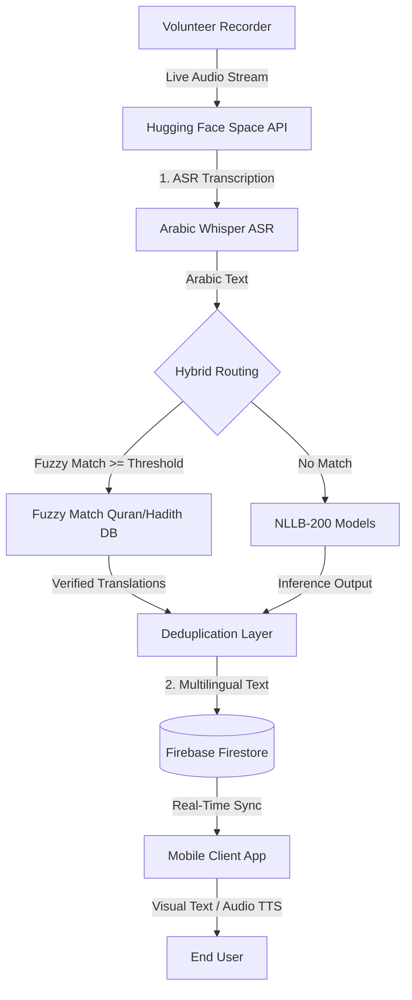

# Aban (أبان): An End-to-End Real-Time Speech Translation Platform for Friday Sermons (Khutbahs)

[](https://flutter.dev)
[](https://fastapi.tiangolo.com)
[](https://pytorch.org)
[](https://huggingface.co/spaces)

**Aban (أبان)** is an academic and production-grade software platform developed to bridge language barriers for non-Arabic speakers during live Friday sermons (Khutbahs). The platform enables real-time Automatic Speech Recognition (ASR) of classical Arabic audio, dynamic Neural Machine Translation (NMT) into multiple target languages (English, Urdu, Bengali, etc.), and synchronous delivery to mobile clients with Text-to-Speech (TTS) capabilities.

---

## 🏛️ System Architecture and Repositories

The Aban project is organized into three distinct repositories, separating the concerns of client delivery, backend model inference, and model training/evaluation.



### 1. Mobile Application Source Code
* **Repository:** [abansermon](https://github.com/NouraAbuthnain/abansermon.git)
* **Role:** The client-facing Flutter application. It features dual interfaces:
  * **User Mode:** Real-time translation screen with synchronous visual text updates, automatic text-to-speech (TTS) playback (using native/cloud hybrid providers), prayer times, Quran references, and historical sermon archives.
  * **Volunteer Mode:** A dashboard for authorized mosque coordinators to stream live sermon audio, start/stop recording sessions, and publish transcripts directly to Firestore.

### 2. Hugging Face Space AI Backend
* **Repository/Space:** [aban-ai-backend](https://huggingface.co/spaces/NorahMT/aban-ai-backend)
* **Role:** The core processing backend. Deployed inside a Docker container using FastAPI, this space hosts the pre-processing and inference pipelines. It ingests live audio streams from volunteers, routes them sequentially through the ASR and MT models, and outputs chunked bilingual transcripts in near zero-latency.

### 3. Speech Translation Training and Evaluation Source Code
* **Repository:** [Aban-ASR-NMT-training](https://github.com/NorahMT/Aban-ASR-NMT-training.git)
* **Role:** The machine learning codebase. Contains the data preparation notebooks, training procedures, fine-tuning scripts, and quantitative evaluation suites used to optimize the performance of both the ASR and NMT models on Islamic and sermon-specific domains.

---

## 🎙️ Automatic Speech Recognition (ASR)

The ASR module converts the acoustic features of live Friday sermons into written Arabic transcripts.

### Model Selection and Fine-Tuning
* **Architecture:** In production, the system utilizes a fine-tuned **Whisper-small** model. This model was selected after a controlled comparison against **Wav2Vec 2.0** on the SAT dataset using a stratified five-fold cross-validation strategy.
* **Domain Adaptation:** Standard speech recognition models often fail to capture classical Arabic (*Fus'ha*), religious nomenclature, and the acoustics of mosque environments (e.g., heavy reverberation, echoes). The Whisper model was fine-tuned to establish noise robustness and high spelling accuracy for religious idioms.

### Real-Time Streaming Pipeline
* The volunteer app captures microphone input and streams audio chunks of approximately **8 seconds** in length with a **1-second overlap** to reduce missing speech boundaries.
* Local silence detection is applied to skip processing silent segments.
* The FastAPI backend processes the chunks using beam search decoding to generate text frames.

---

## 🌐 Hybrid Neural Machine Translation (NMT)

The translation pipeline uses a hybrid strategy to achieve scholarly accuracy for religious quotes while maintaining general translation flexibility for ordinary speech.


### 1. Database Retrieval with Fuzzy Matching (Quran and Hadith)
* **Matching Engine:** Input text is routed through a fuzzy matcher built on the **RapidFuzz** library using the **Levenshtein distance** algorithm. 
* **Scoring Metrics:** The system combines three distinct scoring ratios to evaluate similarity:
  1. *Full-chunk ratio*
  2. *Partial ratio*
  3. *Token-set ratio*
* **Verified Databases:**
  * **Quran:** Verified scholarly translations matched with references (Surah and Ayah) retrieved via the *Al Quran Cloud API*.
  * **Hadith:** Verified translation lookups using the *HadeethEnc* dataset.
* **Decision Gate:** A margin-based score comparison prevents misclassifications when both Quran and Hadith databases return high, competing scores.

### 2. Neural Machine Translation (NMT)
* **Model:** Chunks that fall below the Quran and Hadith matching thresholds are routed to a domain-adapted **NLLB-200** model.
* **Fine-Tuning:** Three distinct translation models were fine-tuned—one for each target language pair:
  * Arabic $\rightarrow$ English
  * Arabic $\rightarrow$ Urdu
  * Arabic $\rightarrow$ Bengali
* **Streaming Deduplication Layer:** Because the 8-second sliding window segmentation does not align with sentence boundaries, the same Quranic verse or Hadith might span across consecutive chunks. A streaming deduplication layer tracks output history and suppresses duplicate emissions of verified sacred text across adjacent chunks.

---

## 📊 Evaluation and Training Infrastructure

* **Training Platforms:** Model training, optimization, and dataset pre-processing were conducted on **Lightning AI cloud studios** and the **Nebius AI cloud** environment.
* **Hardware:** Accelerated using **NVIDIA H200 GPUs** (up to 141 GB HBM3e memory) and 8 CPU cores.
* **Audio Engineering:** Raw audio datasets were pre-processed, resampled to **16 kHz**, and managed using the `librosa` and `SoundFile` libraries.
* **Evaluation Metrics:**
  * **ASR:** Word Error Rate (WER) and Character Error Rate (CER).
  * **NMT:** BLEU, CHRF, and COMET scores to guarantee high semantic overlap with expert human translations.

---

## 🛠️ Mobile Tech Stack and Setup

The frontend mobile code in this repository is built using:
* **Cross-Platform Framework:** [Flutter](https://flutter.dev) (v3.5+)
* **State Management:** [Riverpod](https://riverpod.dev) for declarative state caching and reactivity.
* **Database and Stream Sync:** [Firebase Firestore](https://firebase.google.com) for serverless real-time document streaming.
* **Localization:** `easy_localization` supporting English, Arabic, Urdu, and Bengali dynamically.
* **Hybrid Text-to-Speech (TTS):** Fallback architecture wrapping Google Cloud Text-to-Speech (Neural2 REST) and native on-device speech engines (`flutter_tts`) via a circuit-breaker failover pattern.

### Quick Setup

1. **Clone the Repository:**
   ```bash
   git clone https://github.com/NouraAbuthnain/abansermon.git
   cd abansermon
   ```

2. **Install Flutter Dependencies:**
   ```bash
   flutter pub get
   ```

3. **Configure the Environment:**
   Create a `.env` file in the root of the project to enable the cloud TTS provider (if left blank, the app will automatically fall back to the native offline TTS engine):
   ```env
   ABAN_GCP_TTS_API_KEY=your_google_cloud_tts_api_key
   ```

4. **Run the App:**
   ```bash
   flutter run
   ```

---

## 🤝 Project Team and Supervisor

### Supervisor
* **Dr. Huda Al-muzaini**

### Aban Team
* **Dana Alsobay**
* **Felwah Almofeez**
* **Norah Altwijri**
* **Noura Abuthnain**
